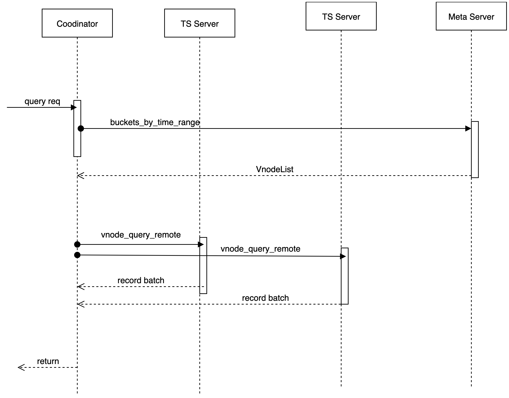
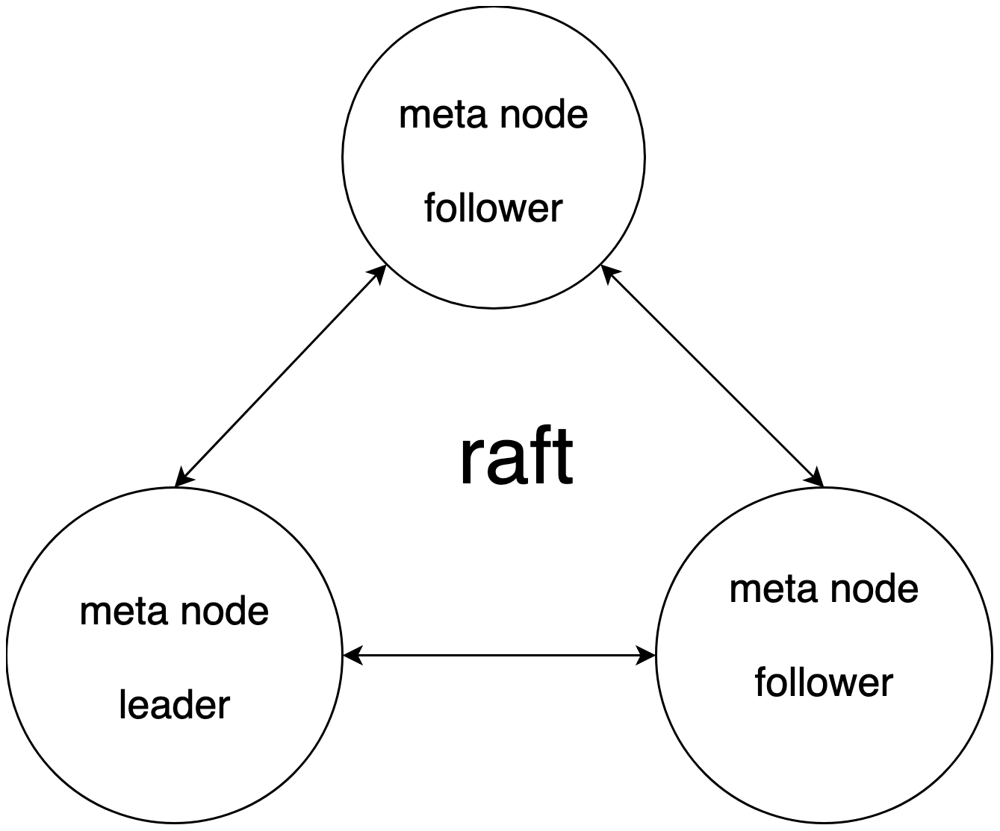

## 设计目标

Cnosdb2.0 使用 Rust 语言进行开发，利用它带来的安全，性能和社区上的影响力争取时序数据库领域有自己的立足之地，形成一套完整的 DBaas 解决方案。


>时序数据库
1. 扩展性，理论上支持的时间序列无上限，彻底解决时间序列膨胀问题，支持横/纵向扩展。
2. 计算存储分离，计算节点和存储节点，可以独立扩缩容，秒级伸缩。
3. 存储性能和成本，高性能io栈，支持利用云盘和对象存储进行分级存储。
4. 查询引擎支持矢量化查询。
5. 支持多种时序协议写入和查询，提供外部组件导入数据。
>云原生
1. 支持云原生，支持充分利用云基础设施带来的便捷，融入云原生生态。
2. 高可用性，秒级故障恢复，支持多云，跨区容灾备灾。
3. 原生支持多租户，按量付费。
4. CDC,日志可以提供订阅和分发到其他节点。
5. 为用户提供更多可配置项，来满足公有云用户的多场景复杂需求。
6. 云边端协同，提供边端与公有云融合的能力
7. 融合云上OLAP/CloudAI 数据生态系统。


在重新设计时序数据库的过程中我们尽可能去解决当前时序数据库面临的一系列问题，形成一套完整的时序数据解决方案及时序生态系统，在公有云提供 DBaas 服务。


> 下面我们将从一下几个方面进行详细阐述,

- 数据复制与共识
- meta 集群
- SQL 引擎
- tskv 索引与数据存储

## 数据复制与共识

Cnosdb2.0 的分片规则使用基于 time-range 的分区规则
我们 采用 db + time_range 来放入对应的 bucket 中，bucket 是一个虚拟逻辑单元，每个 bucket 由以下主要的属性, bucket 会根据用户配置创建多个分片，把数据打散（默认情况下数据的分片 shard num 是 1）。

> 「db , shardid, time_range, create_time, end_time, List\<Vnode\>」

Vnode 是一个虚拟的运行单元，分布到一个具体的 Node 上，每个 Vnode 是单独 lsm tree 对应 tsfamily 结构体 是一个独立的运行单元。


### 复制组（replicaset）

数据的高可用通过数据 replicaset 维护。 每个 db 都会又一个自己的复制组 表示数据冗余份数。 同一个 bucket 内的一组 List\<Vnode\> 组成了 一个复制组， 他们之间具有相同的数据和倒排索引信息。

### 放置规则 （place rule）

为了解决并发故障的可能性， meta 节点在创建 bucket 的时候，可能需要确保数据副本位于使用不同 node、机架、电源、控制器和物理位置的设备上，考虑不同租户会在不同 region 进行访问数据，需要将 vnode 按照最优成本的方式进行调度排放。

### 数据的分隔策略：

在 Node 上不同租户的数据是在物理上进行分割的
/User/db/bucket/replacaset_id/vnode_id


### 基于 Quorum 机制的数据共识

#### Cnosdb2.0 实现为一个最终一致性的系统

我们使用 Quorum 机制来做数据共识
负责处理读或写请求的模块为 coordinator

- 元信息缓存，与 meta 节点交互
  根据（user，db， timerange）获取 Vnode 信息，在本地维护了一份缓存， 在本地没有命中的情况下去远端拉取 VnodeList。 提供了一个 MetaClient 的 trait
- connetion 管理
  管理与不同的 tskv 的 connection， 用于数据读取/写入
- 数据读/写/删的代理操作
  数据根据用户配置 支持多种不同的一致性级别。
  ```Rust
  pub enum ConsistencyLevel {
      /// allows for hinted handoff, potentially no write happened yet.
      Any,
      /// at least one data node acknowledged a write/read.
      One,
      /// a quorum of data nodes to acknowledge a write/read.
      Quorum,
      /// requires all data nodes to acknowledge a write/read.
      All,
      }
  ```
- Hinted handoff  
   目标节点临时故障的场景下加入 提供 condinator 节点的 Hinted handoff 功能，节点的 Hinted handoff 队列中持久化保存，等到副本节点故障恢复后，再从 Hinted handoff 队列中复制恢复。

数据写入
当收到一个 write 请求后，coordinator 根据 分区策略以及 db 对应的放置规则 （place-rule),确定出要存放的数据所在物理节点（node）。只要有至少 W 个节点返回成功，这次写操作就认为是成功了

#### 写流程


数据读取
当收到一个 read 请求后，coordinator 会根据分区策略以及 db 对应的放置规则 （place-rule),确定出要存放的数据所在物理节点（node）请求这个 key 对应的数据，当前我们不实现读修复（read repair）的功能， 执发起一个读请求。 在读延迟的情况下 发起第二个读请求。

#### 读流程



#### 更新冲突

1.  在时序场景下数据产生冲突之后 采用将一致性 hash 换上第一副本(replca)为确认点
2.  同时间戳的采用 last-write-win 的策略解决冲突。

## Meta 集群

通过 raft 去维护一个强一致性的 meta 集群。meta 集群 api 的方式对外进行服务，同时 node 也会对 meta 信息的更新进行进行订阅。所有的元数据信息的更新都通过 meta 集群进行更新。


> 1.  数据库 catalog 信息，DDL 操作。
> 2.  节点探活/节点注册，以及节点负载信息统计，作为 coordinator 进行选择的 read 和 write 的依据。
> 3.  租户以及子用户信息以及权限相关。
> 4.  数据路由信息，tenant/db/bucket/replacaset 对应的 vnodeList 的路由信息。
> 5.  提供分布式锁和 watch 变更通知的功能

我们采用 强一致性 meta 集群 原因如下，并提出优化方案

> - 实际在工程实践中我们通常集群中元数据通常控制在较小的规模，无扩展性需求。
> - 工程实践相对简单，有利于快速实施迭代。
> - 对访问频繁的数据进行 cache 和 本地化存储，进行优化。
>   - schema 信息 在本地存储后，订阅来自 meta 集群的 schema version 变更，缓解 meta 集群读压力。
>   - meta 集群 分担 leader 压力，提供 Follower Read 方案 读性能优化。

## SQL 引擎

查询引擎我们使用了[datafusion](https://arrow.apache.org/datafusion/)
DataFusion 是一个可扩展的查询执行框架，用 Rust 编写，使用[Apache Arrow](https://arrow.apache.org/)作为其内存格式。
DataFusion 支持用于构建逻辑查询计划的 SQL 和 DataFrame API 以及能够使用线程对
分区数据源并行执行的查询优化器和执行引擎。
具有如下优点：

1. 高性能：利用 Rust 和 Arrow 的内存模型，具有较高的性能。
2. 扩展性强：允许在其设计中的几乎任何点进行扩展，可以针特定用例进行定制
3. 高质量：DataFusion 和 Arrow 生态都经过广泛测试，可用作生产系统。
4. 融合大数据生态：作为 Apache Arrow 生态系统（Arrow、Flight、Parquet）的一部分，与大数据生态系统融合的较好

我们通过扩展 datafusion 的数据源并且提供自定义 sql 语句，在分布式场景下数据的查询流程如下：


## tskv 索引与数据存储

tskv 主要承担数据和索引的存储,对 node 节点上所有 vnode 进行管理, 每个 vnode 负责某个 db 里的部分数据。 在 vnode 中主要有 3 个模块组成 WAL，IndexEngine 和 DataEngine，


### IndexEngine

用来存储时序数据的索引通常来说是读多写少的模型，主要能够进行快速索引和基于 tagkey 进行条件过滤，过滤出合适的 series。
主要功能有

1. 存储正派索引，
2. 存储倒排索引，
3. 缓存 catalog 信息

常用查询语句

```
select xxx from table where tag1= value1 && tag2=value2 [and time > aaa and time < bbb] [group by\order by\limit ....]
```

索引的设计主要针对 where 过滤条件；用于降低数据的搜索规模，加快数据的查询效率。
支持以下几种过滤条件

> 1. 等于、不等于；如：tag=value，tag!=value
> 2. 大于、小于；如：tag < value
> 3. 前缀匹配；如：tag=aaa\_\*
> 4. 正则表达式；如：tag=aaa\*bbb

数据写入的时进行索引的构建。在时序数据库中多是对每个 tag 进行索引，多个 tag 所对应的 value 组合为一个 serieskey。
虽然时序数据库是写多读少，但是写入数据时对索引的使用更多是读取而不是构建。时序数据库多是对同一个 series 不同时间点采样写入，所以每个 series 的索引信息只在第一次写入时需要构建，后面写入时判断 series 存在（读操作）就不再进行索引构建；

存储结构

1. 根据 hash 函数计算 hash_id：hash(SeriesKey) -> hash_id(24 位整形，大约 1600 万);
   2.hash_id 与自增 id 得到 serie_id(uint64)：hash_id << 40 | auto_increment_id ->serie_id
1. field_id（uint64）由 serie_id 与 table_filed_id 组合而成(field 在 table 内部有一个编号记为 table_filed_id)：field_id 的高 24 位是 table_filed_id、低 40 位是 series_id 的低 40 位。
   限制条件：
   1. HashID 数量大约 1600 万，单台机器 Series 规模上亿以后会导致 List 变长拖累查找。
   2. SeriesID 的高 24 位有其他用途，只有低 40 位有意义大约是 1 万亿左右。
   TSM 数据文件存放 FieldID 以及对应的 Data 信息；
   SeriesKey 相关信息存放在索引文件，下面讲述索引数据组织方式

索引数据结构设计

1. HashList：HashID -> List<(SeriesKey、SeriesID)> 用于 SeriesKey 与 SeriesID 互查
   1. SeriesKey 查找 SeriesID 过程：Hash(SeriesKey) -> HashID，根据 HashID 从 HashList 中得到 List\<SeriesKey、SeriesID\>，然后遍历 List 获取 SeriesID。
   2. SeriesID 查找 SeriesKey 过程，取 SeriesID 的高 24 位为 HashID，后面查找过程同上。
2. TagValue -> List\<SeriesID\>实现对 Tag 的索引功能，用途  tag 查询条件过滤
   1. 查询条件：where tag=value，根据 TagValue 得到 SeriesID 列表，进一步获取 FieldID 从 TSM 文件加载数据。
   2. 多个查询条件与或需要对多个List\<SeriesID\>进行交、并操作。
3. 要求 TagValue 顺序存储可遍历访问。用途 show tag values 查询
   HashList 结构需要在内存维护一份，惰性加载。
   HashID -> List<(SeriesKey、SeriesID)>与 TagValue -> List\<SeriesID\>进行持久化。

### DataEngine

主要是用来存储时序数据的数据通常来说是写多读少的场景，使用 lsm 的模型，主要是能够快速进行数据写入，同时通过 compaction 清除掉过期和被删除的数据。 DataEngine 分为如下几个模块进行：介绍 WAL，

#### WAL 模块

wal 为写前日志，将操作具体应用到内存前append到磁盘中的wal文件里，数据库在崩溃后恢复时，这个日志将被用来使内存恢复到一致的状态。
当接收到写入请求后，wal_job 首先会检查当前 wal 文件是否已满，如果满了就新建一个；然后开始按照一定格式将内容写入文件中。每一个req单独对应一个seq-no，seq-no递增，用来记录开机以来有多少batch已经被写入。
wal_job线程会将这个 seq_no 传回主线程，同一batch的每个point都有相同的seq_no写入内存或flush成tsm时都会针对 seq_no 进行一定的处理。

#### TimeSeriesFamily

TimeSeriesFamily, 时序数据的储存单元，保存着对应的内存中的数据和对应的磁盘中的数据的元数据，一般简写为 tsfamily
我们在写入数据前，会根据数据的 tag 和 field 生成 seriesid 和 fieldid。coordinator 根据 db 和 timerange，获取 bucekt，根据 hash（seriesid）% shard_nums 获取 familyid 向 tsfamily 写数据。
tsfamily 成员如下

```
pub struct TseriesFamily {
    tf_id: u32,
    delta_mut_cache: Arc<RwLock<MemCache>>,
    delta_immut_cache: Vec<Arc<RwLock<MemCache>>>,
    mut_cache: Arc<RwLock<MemCache>>,
    immut_cache: Vec<Arc<RwLock<MemCache>>>,
    super_version: Arc<SuperVersion>,
    super_version_id: AtomicU64,
    version: Arc<RwLock<Version>>,
    opts: Arc<TseriesFamOpt>,
    seq_no: u64,
    immut_ts_min: i64,
    mut_ts_max: i64,
}
```

tf_id：tsfamily 的标识符，每个 tsfamily 具有唯一的 tf_id。
mut-cache：用于 cache 最新写入的数据
immut-cache：当 mut-cache 满了后，转为 immutchache，immut-cache，flush 到磁盘，生成 tsm 文件
super-version：当 tsfamily 的 mut-cache 和 immut-cache 的快照数据。
version：维护当前 tsfaimily 中磁盘数据的快照，

#### Recover 和 Summary

Summary 是 tsm 文件版本变更产生的元数据文件，summary 会对应存储 summary 文件，summary 文件中存储着版本变更元信息 versionedit，用于宕机恢复 version_set 元数据，node 节点长时间运行会产生较大的 summary 文件，我们会定期将 summary 文件进行整合。减少宕机恢复的时间。

Recovertskv 在创建时首先会执行 recover 函数

1. 从 summary 文件中获取得到 summary 结构体
2. 根据 summary 结构体的 ctx 的 last_seq，得知有哪些 batch 已经被 flush 成文件
3. 根据 wal 文件和 last_seq，将没有被 flush 的 batch 重新写入到内存中
4. 更具 summary 文件恢复出 version_set

#### Flush

当 tsfamily 中 imut-cache 容量达到一定程度后，就会开始进行 flush
在执行完写入操作后，当发现 imut-cache 满了后，将其中的数据拿出来打包成一个 flush_request，由 flush_job 线程，线程接收到请求后开始处理。

1. 将 flush-request 中的数据取出，根据数据创建一个 flushtask，执行
2. 根据 tfid，fileid 创建 tsm 文件，将数据写入 tsm 文件
3. 根据文件信息，apply 元数据到 version 的 levels_info 的对应的 level_info
4. 根据对 version 的修改以及 seq-no，tsfid 等，生成 version edit
5. 将所有生成的 version edit 通过 tskv 的 summary_task_sender 发送给 tskv 创建时一并创建的 summary_job 线程，线程接收到请求后开始处理，将 version edit 写入 summary 文件

#### compaction

我们是使用类 LSMtree 的方式 进行数据整理。 通常情况下时序数据库的写入是按照时间顺序的方式写入点。 在 IOT 也会有补录数据的场景， 会导致时间戳陈旧的问题。 除此之外 在共有云的场景下很难保证所有的用户的写入顺序。面对多种复杂的写入场景，我们需要在对数据 compaction 的时候考虑多种复杂的场景。
compaction 目的

1. 把小的 tsm 文件进行聚合 生成较大的 tsm 文件。
2. 清理到过期或者被删除的文件。
3. 减小读放大，维护我们当前 version 中维护的 levelinfo 的元数据。

- level_range compaction
  

1. 通常情况下 时间序列数据库，是按照时间点的数据进行顺序写入，为了应对乱序数据的我们增加 delta 文件， delta 的数据会刷到 L0 层。
2. 从 L1 到 L3，LevelInfo 中的数据是按照时间进行分层排放的。 每一层都有一个固定的时间范围 且 不会重叠，memcache 中的数据是有一个固定的 time range。每一层的时间范围都会有在 compaction 或者 flush 的时候进行动态更新。
3. 每次新写入的 TSM 文件都是具有本层最新的时间范围。 即 L0 层中 filename 中文件 id 最大 tsm 文件所持有的时间范围中 TimeRange（ts_min, ts_max), ts_max 是最大的。
4. compact 的 pick 流程会，会建立一个虚拟的 time_window。time_window 会选取本层中合适的 tsm 文件 进行 compaction 到下一层。同时更新本层 level_info 的数据。将 level_info 中 tsmin 更新到 time_window 的最大时间戳，即本层的时间范围向前推进。新生成的 tsm 文件会放入到下一层，下一层的 time_range 的 ts_max 推进到 time_window 的最大值。
5. 在 L3 开始，按照 table 把 tsm 文件按照目录进行划分；同一个 table 的 tsm 文件放到一起。 支持生成 parquet 文件 放到 S3 上进行分级存储。

- time_window compaction
  

1. 基于 window 的 compaction 方式 不同 levelrange 的 compaction 方式， 从 immutecache flush 到磁盘中时，会根据 tsm 的时间范围生成不同的 tsm 文件放入到对应的 window 中， window 随着时间的推移，会动态创建。每个 window 负责一段时间内的写入。
2. 在 window 内部会有一些离散的数据 tsm 文件块 需要进行合并。 生成较大的文件块。 window 内部会维护一个关于文件的元信息一个列表。
   相比与 level_range 的合并方式。 time_window 的 compaction 方式会减小写入的放大。

- data_engine 数据流
  

## 其他系统设计

### 租户隔离

#### query 层

在 datafusion 中，catalog 隔离关系分为 caltalog/schema/table。我们利用这种隔离关系， 拆分租户之间的隔离关系为 tenant（namespace）/database/table。

1. table，对应到具体的数据库中的一个具体的表，提供具体 table 的 shema 定义实现 TableProvider
2. database，对应到具体数据库中一个 database，database 下面管理多个 table。
3. namespace，对应 Catalog。 每个租户独占一个 caltalog，不同的租户中看到的 db 都是不一样的，并且不同的租户可以使用相同的 database name。 用户登陆的时候在 session 中拿到 tenantid 默认看到自在所在的 namespace，这个意义上 namespace 有软隔离的作用

#### tskv 层

上面的介绍中提到的目录分割策略： /User/db/bucket/replacaset_id/vnode_id
tskv 是每个 Node 节点上的一个实例。 保存当前 Node 上所有的 vnode 的信息。 每个 Vnode 把数据保存在单独的目录下。根据配置的 db retention policy，将数据清理掉。 同时我们可以方便的进行数据目录的大小统计，对租户进行计费。
